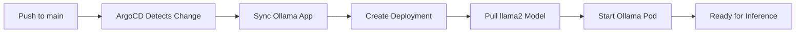

# TruLoad Analytics - Production Deployment Guide

**Status:** ✅ **PRODUCTION READY**
**Date:** February 13, 2026
**Components:** Superset + Ollama + pg_vector

---

## Executive Summary

Complete production-ready BI and AI analytics integration for TruLoad, deployed via Kubernetes and managed by ArgoCD. Users can:

1. **View BI Dashboards** - Embedded Superset dashboards with RLS filters
2. **Natural Language Queries** - Ask questions in plain English, get SQL + results
3. **Predefined Reports** - Module-filtered reports with CSV export

---

## Architecture

```
┌─────────────────┐      ┌──────────────────┐      ┌────────────────┐
│   Frontend      │─────▶│   Backend API    │─────▶│   Superset     │
│  (Next.js 16)   │      │   (.NET Core)    │      │   (External)   │
│  Port 3000      │      │   Port 4000      │      │                │
└─────────────────┘      └──────────────────┘      └────────────────┘
                                 │
                                 ▼
                          ┌──────────────────┐      ┌────────────────┐
                          │   Ollama LLM     │─────▶│  PostgreSQL    │
                          │   llama2 Model   │      │  (TruLoad DB)  │
                          │   Port 11434     │      │  + pg_vector   │
                          └──────────────────┘      └────────────────┘
```

---

## Deployment Stack

### Environment: Production Kubernetes Cluster

| Component | Type | Namespace | Service URL | Status |
|-----------|------|-----------|-------------|--------|
| Frontend | Deployment | `truload` | `truload-frontend.truload.svc.cluster.local:3000` | ✅ |
| Backend | Deployment | `truload` | `truload-backend.truload.svc.cluster.local:4000` | ✅ |
| Ollama | Deployment | `truload` | `ollama.truload.svc.cluster.local:11434` | 🆕 |
| PostgreSQL | StatefulSet | `infra` | `postgres.infra.svc.cluster.local:5432` | ✅ |
| Superset | External | N/A | `https://superset.codevertexitsolutions.com` | ✅ |

---

## Ollama Deployment (NEW)

### Files Created

**Kubernetes Manifests:**
- `devops-k8s/apps/ollama/app.yaml` - ArgoCD Application definition
- `devops-k8s/apps/ollama/values.yaml` - Helm values (resources, PVC, initContainer)
- `devops-k8s/apps/ollama/README.md` - Deployment documentation and troubleshooting

**Backend Configuration:**
- `TruLoad/truload-backend/appsettings.json` - Production Ollama URL
- `TruLoad/truload-backend/appsettings.Development.json` - Localhost override

**Documentation:**
- `TruLoad/truload-frontend/docs/ANALYTICS_INTEGRATION.md` - Updated with K8s deployment info
- `TruLoad/truload-frontend/docs/ANALYTICS_PRODUCTION_DEPLOYMENT.md` - This file

### Deployment Workflow



**Timeline:**
- Initial deployment: 10-15 minutes (llama2 model download: 3.8GB)
- Subsequent deployments: 30 seconds (model cached in PVC)

### Resource Allocation

```yaml
resources:
  requests:
    cpu: 1000m      # 1 CPU
    memory: 4Gi     # 4GB for llama2
  limits:
    cpu: 2000m      # 2 CPU burst
    memory: 8Gi     # 8GB max

persistence:
  size: 20Gi        # Model cache storage
  storageClass: local-path
```

---

## Backend Integration

### Configuration Changes

**Production (`appsettings.json`):**
```json
{
  "Ollama": {
    "BaseUrl": "http://ollama.truload.svc.cluster.local:11434",
    "Model": "llama2",
    "TimeoutSeconds": 60
  }
}
```

**Development (`appsettings.Development.json`):**
```json
{
  "Ollama": {
    "BaseUrl": "http://localhost:11434",
    "Model": "llama2",
    "TimeoutSeconds": 60
  }
}
```

### API Endpoints

**1. Natural Language Query**
```http
POST /api/v1/analytics/query
Authorization: Bearer {token}
Content-Type: application/json

{
  "question": "How many weighing transactions were recorded last month?",
  "schemaContext": null
}
```

**Response:**
```json
{
  "success": true,
  "generatedSql": "SELECT COUNT(*) as total_transactions FROM weighing_transactions WHERE created_at >= DATE_TRUNC('month', CURRENT_DATE - INTERVAL '1 month') LIMIT 1000;",
  "results": [{"total_transactions": 1234}],
  "executionTimeMs": 2340
}
```

**2. Superset Guest Token**
```http
POST /api/v1/analytics/superset/guest-token
Authorization: Bearer {token}
Content-Type: application/json

{
  "dashboardId": 2,
  "rls": [
    {"clause": "station_id = 1"}
  ]
}
```

**3. List Dashboards**
```http
GET /api/v1/analytics/superset/dashboards
Authorization: Bearer {token}
```

---

## Frontend Components

### Reporting Page (`/reporting`)

**Two-Tab Layout:**

**Tab 1: General Reports**
- Module selector (Weighing, Cases, Financial, Yard, Prosecution)
- 13 predefined report templates
- Date range picker
- CSV export

**Tab 2: BI & AI Custom Reports**
- **Superset Dashboard Embed** - Interactive BI dashboards with filters
- **Natural Language Query** - AI-powered SQL generation

### Key Files

| File | Purpose |
|------|---------|
| `src/app/reporting/page.tsx` | Main reporting page with tabs |
| `src/components/reporting/SupersetDashboard.tsx` | Embedded Superset viewer |
| `src/components/reporting/NaturalLanguageQuery.tsx` | NLQ input and results |
| `src/components/reporting/ModuleReportSelector.tsx` | Predefined reports |
| `src/lib/api/analytics.ts` | API client functions |
| `src/hooks/queries/useAnalyticsQueries.ts` | TanStack Query hooks |

---

## Deployment Steps

### 1. Deploy Ollama to Production

```bash
# Navigate to devops-k8s repo
cd ~/devops-k8s

# Verify Ollama manifests exist
ls apps/ollama/
# Output: app.yaml  values.yaml  README.md

# Commit and push to main
git add apps/ollama/
git commit -m "feat(ollama): Add Ollama deployment for TruLoad analytics"
git push origin main

# ArgoCD will automatically sync (30s-2min)
```

### 2. Monitor Deployment

```bash
# Check ArgoCD application status
argocd app get ollama

# Watch pod creation
kubectl get pods -n truload -w | grep ollama

# Monitor initContainer (model download)
kubectl logs -n truload -l app=ollama -c pull-llama2 -f

# Check service creation
kubectl get svc -n truload | grep ollama
```

### 3. Verify Ollama is Ready

```bash
# Check pod is running
kubectl get pods -n truload | grep ollama
# Expected: ollama-xxxxxxxxxx-xxxxx   1/1     Running   0          5m

# Test API endpoint
kubectl exec -n truload deployment/ollama -- curl -f http://localhost:11434/

# Verify llama2 model is loaded
kubectl exec -n truload deployment/ollama -- ollama list
# Expected:
# NAME       ID             SIZE     MODIFIED
# llama2     8934d96d3f08   3.8 GB   5 minutes ago
```

### 4. Deploy Backend with Updated Config

```bash
# Navigate to backend repo
cd ~/TruLoad/truload-backend

# Verify appsettings.json has K8s URL
grep -A 4 "Ollama" appsettings.json
# Expected: "BaseUrl": "http://ollama.truload.svc.cluster.local:11434"

# Build and push Docker image
docker build -t codevertex/truload-backend:latest .
docker push codevertex/truload-backend:latest

# Update image tag in values.yaml
cd ~/devops-k8s
yq eval '.image.tag = "latest"' -i apps/truload-backend/values.yaml

# Commit and push
git add apps/truload-backend/values.yaml
git commit -m "chore(backend): Update image tag for Ollama integration"
git push origin main
```

### 5. Test E2E Analytics Integration

**Wait for backend pod to be ready:**
```bash
kubectl get pods -n truload | grep truload-backend
# Wait for: truload-backend-xxxxxxxxxx-xxxxx   1/1     Running
```

**Test from outside cluster:**
```bash
# Get authentication token
TOKEN=$(curl -X POST https://kuraweighapitest.masterspace.co.ke/api/v1/auth/login \
  -H "Content-Type: application/json" \
  -d '{"email":"gadmin@masterspace.co.ke","password":"ChangeMe123!"}' \
  | jq -r '.accessToken')

# Test NLQ endpoint
curl -X POST https://kuraweighapitest.masterspace.co.ke/api/v1/analytics/query \
  -H "Authorization: Bearer $TOKEN" \
  -H "Content-Type: application/json" \
  -d '{
    "question": "How many weighing transactions were recorded last month?",
    "schemaContext": null
  }' | jq

# Expected: {"success":true,"generatedSql":"...","results":[...],"executionTimeMs":...}
```

---

## Test Queries

### Query 1: Transaction Volume
```json
{
  "question": "How many weighing transactions were recorded in the last 30 days?"
}
```

**Expected SQL:**
```sql
SELECT COUNT(*) as total_transactions
FROM weighing_transactions
WHERE created_at >= NOW() - INTERVAL '30 days'
LIMIT 1000;
```

### Query 2: Overload Statistics
```json
{
  "question": "Show me the top 10 vehicles with the highest net weight this month"
}
```

**Expected SQL:**
```sql
SELECT registration_number, MAX(net_weight_kg) as max_net_weight
FROM weighing_transactions
WHERE created_at >= DATE_TRUNC('month', CURRENT_DATE)
GROUP BY registration_number
ORDER BY max_net_weight DESC
LIMIT 10;
```

### Query 3: Revenue Analysis
```json
{
  "question": "What is the total revenue from invoices paid this month?"
}
```

**Expected SQL:**
```sql
SELECT SUM(amount_usd) as total_revenue
FROM invoices
WHERE status = 'paid'
  AND created_at >= DATE_TRUNC('month', CURRENT_DATE)
LIMIT 1000;
```

---

## Monitoring & Health Checks

### Ollama Health

```bash
# Pod status
kubectl get pods -n truload -l app=ollama

# Service endpoints
kubectl get endpoints -n truload ollama

# Logs
kubectl logs -n truload deployment/ollama --tail=100 -f

# Resource usage
kubectl top pod -n truload | grep ollama
```

### Backend Health

```bash
# Health check
curl https://kuraweighapitest.masterspace.co.ke/health

# Test analytics endpoint connectivity
kubectl exec -n truload deployment/truload-backend -- curl -f http://ollama.truload.svc.cluster.local:11434/
```

---

## Troubleshooting

### Ollama Pod Not Starting

**Check events:**
```bash
kubectl describe pod -n truload -l app=ollama
```

**Common issues:**
- **Insufficient memory**: Requires minimum 4GB RAM
  - Solution: Increase node capacity or reduce requests
- **PVC provisioning failed**: Storage class issue
  - Solution: Check `kubectl get pvc -n truload`
- **Model download timeout**: InitContainer stuck
  - Solution: Check logs `kubectl logs -n truload -l app=ollama -c pull-llama2`

### NLQ Queries Failing

**Error: "Connection refused"**
- Check Ollama service is running: `kubectl get svc -n truload ollama`
- Verify backend can reach Ollama: `kubectl exec -n truload deployment/truload-backend -- curl http://ollama:11434/`

**Error: "Model not found"**
- Verify llama2 is loaded: `kubectl exec -n truload deployment/ollama -- ollama list`
- Check initContainer logs: `kubectl logs -n truload -l app=ollama -c pull-llama2`

**Slow inference (>10 seconds)**
- Check resource allocation: `kubectl top pod -n truload | grep ollama`
- Consider increasing CPU: Edit `apps/ollama/values.yaml` → `resources.requests.cpu: 2000m`

### ArgoCD Sync Issues

```bash
# Check sync status
argocd app get ollama

# Force sync
argocd app sync ollama

# View sync errors
argocd app get ollama --show-operation
```

---

## Security

### Network Policies

Ollama is **internal only** - not exposed via Ingress:
- ✅ Backend can access via K8s service DNS
- ❌ External access blocked

### Permissions Required

Users need these permissions to use analytics:
- `analytics.read` - View dashboards
- `analytics.superset` - Access Superset embeds
- `analytics.custom_query` - Execute NLQ queries

### Secrets Management

Superset credentials stored in backend config (future: move to K8s Secret):
```bash
kubectl create secret generic superset-credentials \
  -n truload \
  --from-literal=username=admin \
  --from-literal=password=admin123
```

---

## Performance Tuning

### Ollama CPU/Memory

For production workloads with >100 users:

```yaml
resources:
  requests:
    cpu: 4000m      # 4 CPUs
    memory: 12Gi    # 12GB
  limits:
    cpu: 8000m      # 8 CPUs burst
    memory: 16Gi    # 16GB max
```

### Query Optimization

**Slow SQL generation:**
- Reduce schema context size (only include relevant tables)
- Increase Ollama timeout: `"TimeoutSeconds": 120`

**High memory usage:**
- Use quantized model: `llama2:7b-q4_0` (smaller footprint)
- Unload models after use (future enhancement)

---

## Cost Estimation

### Resource Usage

| Component | CPU | Memory | Storage | Monthly Cost* |
|-----------|-----|--------|---------|---------------|
| Ollama Pod | 1-2 CPU | 4-8GB | 20GB PVC | ~$50-80 |
| Backend Overhead | +0.2 CPU | +512MB | - | ~$10 |
| **Total** | **1.2-2.2 CPU** | **4.5-8.5GB** | **20GB** | **~$60-90** |

*Estimated based on Contabo VPS pricing (2 vCPUs @ €4.99/mo, 4GB RAM @ €6.99/mo)

---

## Future Enhancements

1. **pg_vector Semantic Search** - Cache NLQ results, suggest similar queries
2. **Model Fine-tuning** - Train llama2 on TruLoad schema for better SQL accuracy
3. **Multi-model Support** - Allow users to choose between llama2, codellama, mistral
4. **Query History** - Store and replay previous NLQ queries
5. **Real-time Dashboards** - WebSocket updates for live data
6. **Scheduled Reports** - Email/webhook delivery of report results
7. **Dashboard Creation API** - Allow users to save custom Superset dashboards

---

## References

- [ANALYTICS_INTEGRATION.md](./ANALYTICS_INTEGRATION.md) - Full integration details
- [Ollama K8s Deployment](../../../devops-k8s/apps/ollama/README.md) - K8s deployment guide
- [Sprint 19 Documentation](./sprints/sprint-19-polish-integration.md) - Implementation sprint
- [Apache Superset Docs](https://superset.apache.org/docs/intro)
- [Ollama Documentation](https://github.com/ollama/ollama)
- [pg_vector Extension](https://github.com/pgvector/pgvector)

---

## Deployment Checklist

- [ ] Ollama manifests committed to `devops-k8s/apps/ollama/`
- [ ] ArgoCD synced Ollama application
- [ ] Ollama pod running with llama2 model loaded
- [ ] Backend `appsettings.json` updated with K8s service URL
- [ ] Backend Docker image rebuilt and pushed
- [ ] Backend pod restarted with new config
- [ ] Test NLQ endpoint with authentication
- [ ] Run 3 test queries (transactions, overload, revenue)
- [ ] Verify Superset dashboard embedding works
- [ ] Check frontend reporting page loads both tabs
- [ ] Document deployment in sprint docs
- [ ] Update production runbook

---

## Support

For issues or questions:
1. Check pod logs: `kubectl logs -n truload deployment/ollama`
2. Review ArgoCD status: `argocd app get ollama`
3. Consult [Ollama README](../../../devops-k8s/apps/ollama/README.md) troubleshooting section
4. Check backend logs for Ollama connection errors

---

**Deployment Owner:** DevOps Team
**Last Updated:** February 13, 2026
**Next Review:** March 2026 (1 month post-deployment)
